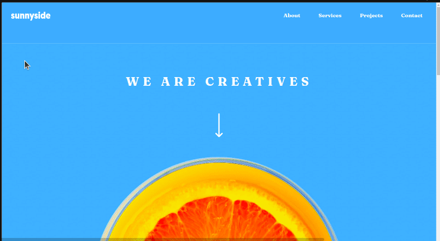
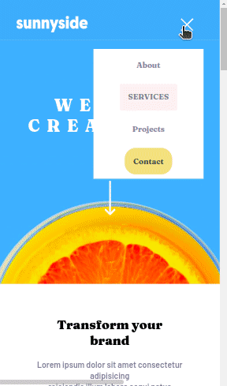

# Agencia-Sunnyside
Este projeto consiste na criação de uma Landing Page, desafio do site Frontend Mentor (Sunnyside agency landing page).

  

## Linguagens Utilizadas:
- HTML 

- CSS  

## Habilidades Desenvolvidas:
- Display Grid
- Display Flex
- Variáveis
- Responsividade

## Veja como ficou:

### Menu Responsivo:

### Desktop
 
 
### Mobile:

